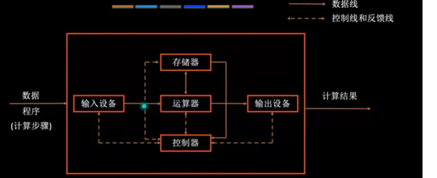
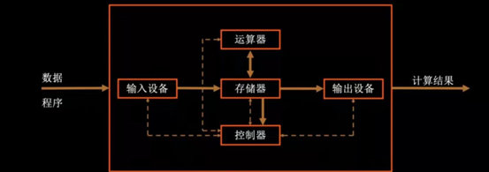
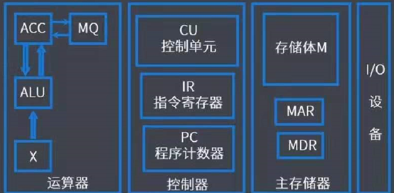
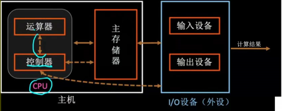
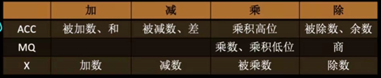
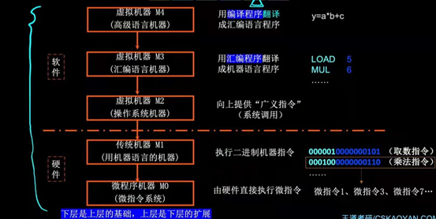
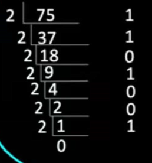
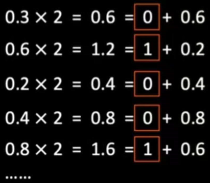

# 一、概述

第一台计算机：1946年宾大的ENIAC

计算机系统 = 硬件 + 软件；软件 = 系统软件 + 应用软件

计算机发展：电子管 - 晶体管 - 集成电路

CPU的机器字长：一次整数运算能处理的二进制位数

摩尔定律：集成电路中集成的晶体管数目每18个月增加一倍，整体性能也提升一倍

## 1 计算机的基本组成

（1）冯.诺依曼计算机

以运算器为中心，第一次出现了存储器）：实线表示数据线，虚线表示控制线，结构如下：

特点：

* 由五大部分组成，运算器、控制器、存储器、输入设备、输出设备

* 指令和数据以同等地位存于存储器中，可按地址寻访

* 指令和数据用二进制表示

* 指令由操作码和地址码组成（操作码必须有，地址码可以0个，1个或多个）

* 指令按顺序存放，存储器存储程序

* 以运算器为中心

（2）现代计算机

以存储器为中心，结构如下：

运算器不再中转数据，提高了运算器效率；IO设备可以直接从存储器读写数据
现代计算机运算器和控制器集成在CPU中，存储器包括主存和辅存，CPU和主存构成主机，输入/输出设备统称IO设备，辅存也是IO设备。

## 2 主机各个部件

如图：

（1）运算器

组成：

* ALU：算术逻辑单元

* ACC：累加器

* MQ：乘商寄存器

* X：通用的操作数寄存器，存放操作数

加减乘除时各部件的存放内容：

（2）控制器

组成：

* CU：控制单元，分析指令和发出控制信号

* IR：指令寄存器

* PC：程序计数器，存放下一条指令地址，能自动 + 1

（3）主存储器

组成：

* M：村粗体

* MAR：存储地址寄存器

* MDR：存储数据寄存器

存储体中有一个个存储单元，存储单元的位数称为存储字长（8比特倍数），存储的实际数据称为存储字，存储元是存储二进制数据的电子元件（电容）

存储单元个数 = 2 ^ MAR位数  

存储单元位数 = MDR位数

字和字节区别：字节8比特，字的比特数根据计算机的结构各有不同（8比特倍数）
字节（Byte），比特（bit），B表示字节，b表示比特。

## 3 计算机的工作过程

取指令 - 分析指令 - 执行指令，根据指令执行的不同阶段，CPU可以判断取出的指令还是数据。

例：y = a * b + c

取指令阶段 （1 - 3）：

① (PC) -> MAR              // 结束后 PC + 1

② M(MAR)  -> MDR     // MDR得到指令

③ (MDR)  -> IR

分析指令阶段 （4）：

④ OP(IR)  -> CU          // OP是取操作码

执行指令阶段 （5 - 7）：

⑤ Ad(IR)  -> MAR         // Ad是取地址码

⑥ M(MAR)  -> MDR    // 取得a

⑦ (MDR)  -> ACC        // ACC得到a

再重复1 - 6，到第七步：

⑦ (MDR)  -> MQ        // MQ得到乘数b 

⑧ (ACC)  -> X             // X得到被乘数a

⑨ (X)*(MQ)  -> ACC  // a * b

再重复1-6，到第七步：

⑦ (MDR)  -> X           // X得到加数

⑧ (ACC)+(X)  -> ACC // ACC+X

运算结束，将 ACC 得到的运算结果写入主存：
重复1-5，到第六步：

⑥ (ACC)  -> MDR

⑦ (MDR)  -> MAR指定的地址

停机：

重复1-4，到第五步：

⑤ 操作系统停止该进程

## 4 计算机系统的层次结构

传统机器又叫实际机器，微指令是指令的细分，上面计算机工作过程各个步骤就是微指令。

## 5 计算机的性能指标

基准程序：测量计算机性能的软件，如跑分软件
（1）CPU

* 主频（时钟频率）：数字脉冲信号的振荡（波峰个数）频率，n/Hz，每秒钟n个脉冲信号

* 时钟周期：一次脉冲信号的时间，= 1 / 主频

* CPI：执行一条指令需要的时钟周期哦数，CPU执行时间（整个程序的耗时）= 指令条数 * CPI * 时

* IPS：每秒钟执行的指令条数，= 主频 / CPI = 1 / CPI / 时钟周期

* FLOPS：每秒钟执行多少次浮点运算

IPS和FLOPS的 K = 10 ^ 3，M = 10 ^ 6，G = 10 ^ 9，T = 10 ^ 12

机器字长：一次整数运算能处理的二进制位数

（2）存储器：

* K = 2 ^ 10，M = 2 ^ 20，G = 2 ^ 30，T = 2 ^ 40

* 存储容量 = 2 ^ MAR 位数 * MDR位数

* 存储字长：存储单元位数

（3）系统整体的性能指标

* 数据通路带宽：数据总线一次能并行传输信息的位数（计算机各个部件之间通过数据总线传输数据）

* 吞吐量：系统单位时间处理请求的数量（请求需要结合具体场景）

* 响应时间：用户向系统发送请求，到系统响应（完成）该请求的时间

# 二、数据的表示和运算

注意：这里面用到的模2加其实就是异或

## 1 表示数字

（1）基本

机器数：计算机中实际存储的二进制（有符号位），

真值：实际书写的值，如十进制+12，二进制+1100,都是真值，而其对应的机器数是0,00001100

（2）进制

基数：r 进制一个数码的取值个数r；

位权：r ^ n……r ^ 2,r ^ 1，r ^ 0，r ^ -1……r ^ -n
表示：二进制B，八进制0，十进制D，十六进制H，0x，r进制在数码右下角小标r

进制转换：

* 2/4/8/16 之间：二进制每2/3/4位是4/8/16进制每一位

* 10 -> r：整数部分（最先得到的是低位）除 r 取余法，小数部分（最先得到的是高位）a，每次 a * r，结果整数是 r 进制位，只留下小数部分，有可能求不尽需要给定精度
  
       

* r -> 10：（每一位的值*位权）之和

（3）BCD码

用4位二进制表示十进制的每一位，用到九个码其他冗余，有三种形式：

1. 8421码：有权码位权8421，0000 — 1001，加法结果 + 0110，手算可以转化成10进制

2. 余3码：无权码，8421码基础上 + 0011，破坏了8421码的权所以无权

3. 2421码：有权码位权2421，由于有相同的位权，为了避免多个编码来编码相同十进制，规定<=4最高位必须0，>=5最高位必须1

## 2 表示字符和字符串

## 3 数据校验

123
